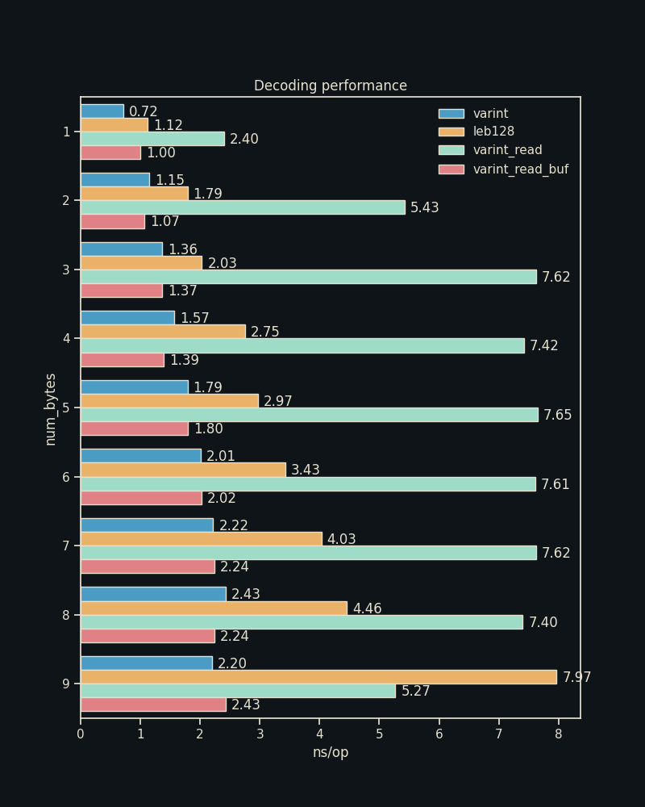

# Benchmarks

## Table of Contents

- [Benchmark Results](#benchmark-results)
  - [writing](#writing)
  - [reading](#reading)

## Benchmark Results

### writing

| num_bytes |   num_ops | ns_per_op_leb128_write | ns_per_op_varint_put | ns_per_op_varint_write |
| --------: | --------: | ---------------------: | -------------------: | ---------------------: |
|         1 | 100000000 |                   1.13 |                 1.04 |                   1.11 |
|         2 | 100000000 |                   1.76 |                 1.42 |                   1.21 |
|         3 | 100000000 |                    2.4 |                 1.56 |                   2.24 |
|         4 | 100000000 |                   3.07 |                 1.99 |                   2.24 |
|         5 | 100000000 |                   3.74 |                 2.22 |                   2.68 |
|         6 | 100000000 |                   4.42 |                 2.43 |                    2.9 |
|         7 | 100000000 |                   5.05 |                 2.64 |                   3.32 |
|         8 | 100000000 |                    5.7 |                 2.86 |                   6.12 |
|         9 | 100000000 |                    8.6 |                 2.84 |                   6.13 |

### reading

| num_bytes |   num_ops | ns_per_op_leb128 | ns_per_op_varint | ns_per_op_varint_read |
| --------: | --------: | ---------------: | ---------------: | --------------------: |
|         1 | 100000000 |             1.11 |              0.9 |                  0.99 |
|         2 | 100000000 |             1.79 |             1.35 |                  1.17 |
|         3 | 100000000 |             2.45 |             1.36 |                  1.37 |
|         4 | 100000000 |              3.1 |             1.79 |                   1.6 |
|         5 | 100000000 |             3.76 |              1.8 |                  1.81 |
|         6 | 100000000 |             4.41 |             2.23 |                  2.04 |
|         7 | 100000000 |             5.08 |             2.24 |                  2.24 |
|         8 | 100000000 |             5.75 |             2.68 |                  2.47 |
|         9 | 100000000 |             9.16 |             2.66 |                  2.67 |

